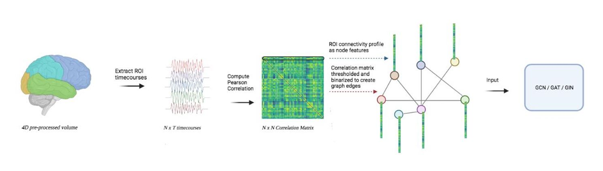

# 🧠 ASD Diagnosis Using Graph Neural Networks (GNNs)

<!-- Project Image -->

&nbsp;  

## 📌 Overview

Autism Spectrum Disorder (ASD) is a complex neurodevelopmental condition often diagnosed through behavioral assessment. However, advancements in neuroimaging and deep learning have made it possible to extract patterns directly from brain activity.  
This project aims to diagnose ASD using **Graph Neural Networks (GNNs)** on **resting-state fMRI** data. Specifically, we train and compare the performance of three commonly used GNN architectures:

- **GCN** (Graph Convolutional Network)
- **GAT** (Graph Attention Network)
- **GIN** (Graph Isomorphism Network)

The goal is to evaluate which architecture performs best in classifying ASD vs. Control subjects.

&nbsp;  

## 🧬 Dataset: ABIDE (Autism Brain Imaging Data Exchange)

We use the public **ABIDE** dataset available at:  
http://preprocessed-connectomes-project.org/abide/

The ABIDE project aggregates **resting-state fMRI (rs-fMRI)** and **structural MRI** data from multiple international research sites. It provides a large-scale collection of brain scans from:

- Individuals diagnosed with **ASD**
- **Typically developing** control subjects
&nbsp;  
### 🧠 About the Dataset

The ABIDE dataset includes hundreds of subjects and allows researchers to investigate functional brain connectivity differences. Due to contributions from many institutions, the dataset includes inherent variability from:

- Scanner hardware differences  
- Preprocessing pipelines  
- Age and demographic variations  

This diversity encourages development of more **robust and generalizable** machine learning models.

&nbsp;  

## 🧠 Preprocessing

ABIDE offers data in various preprocessing pipelines (e.g., **CPAC**, **FSL**, **DPARSF**, **NIAK**), each providing:

- Motion correction  
- Spatial normalization  
- Temporal filtering  
- Brain parcellation (commonly using atlases such as **AAL** or **Harvard-Oxford**)  

From the preprocessed fMRI signals, we construct **functional brain connectivity graphs**, where:

| Graph Component | Description |
|---|---|
| **Nodes** | Brain regions (defined by the chosen atlas) |
| **Edges** | Correlations / similarities between region time-series |
| **Node Features** | Statistical or temporal features of each region |
| **Labels** | ASD or Control classification |
